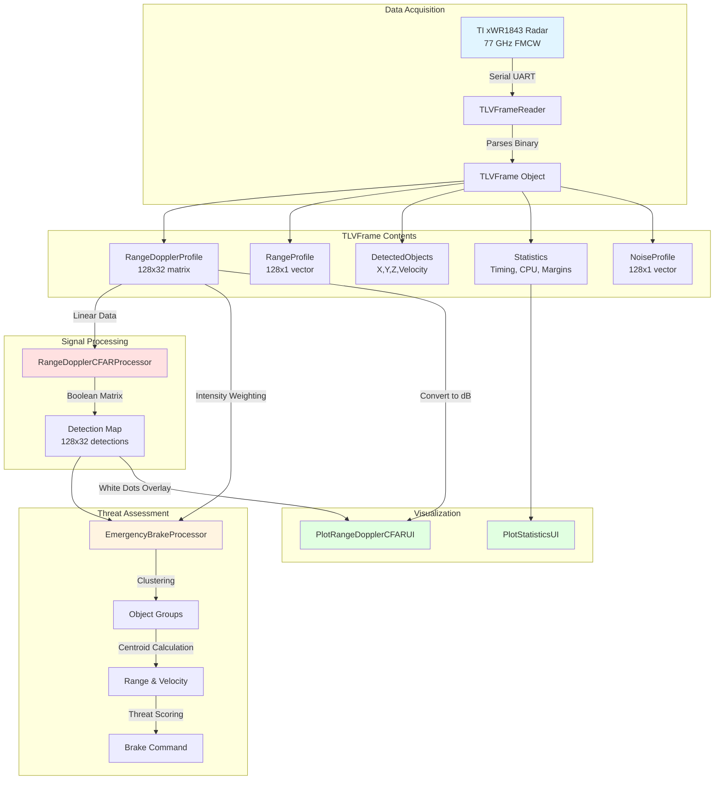
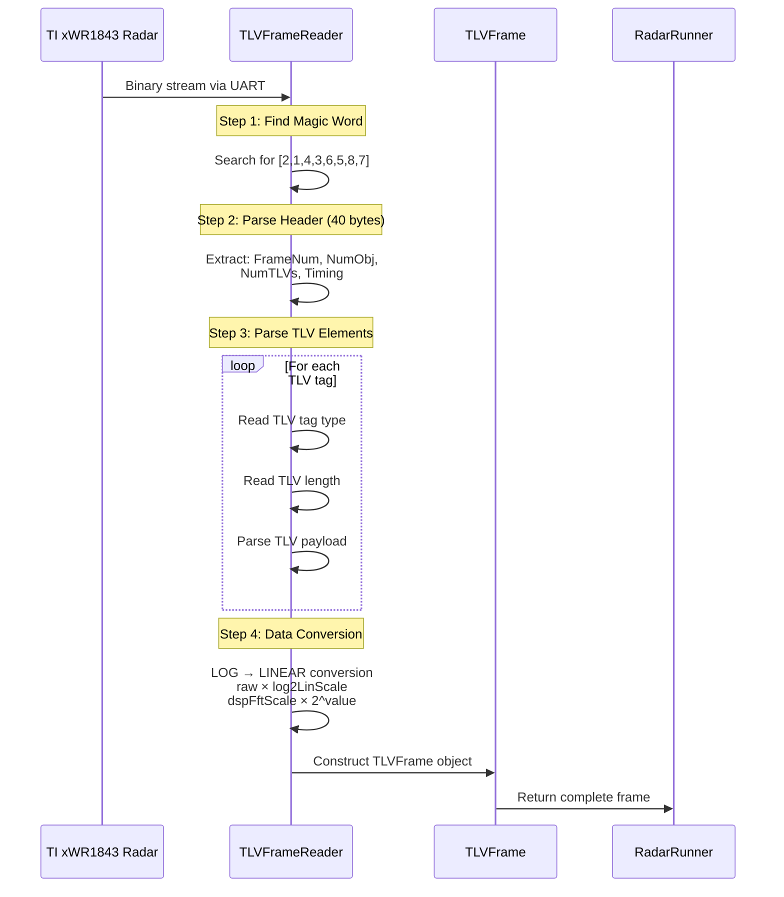
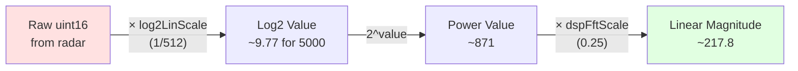
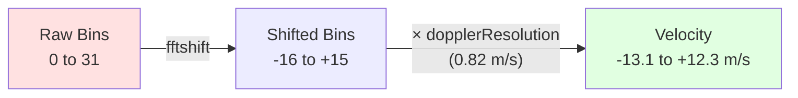
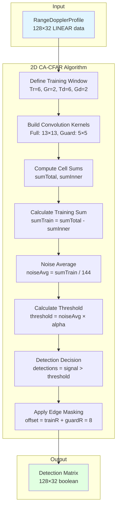
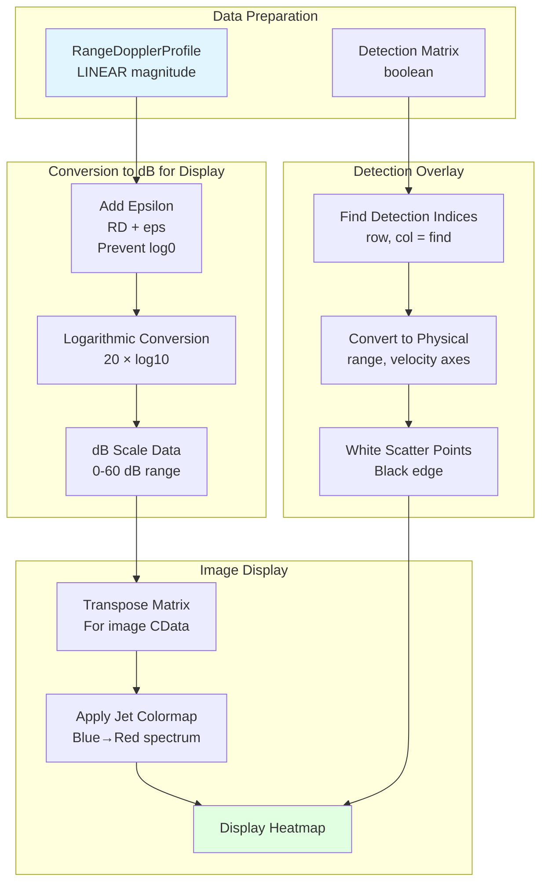

# Emergency Brake Radar System - Dataflow and Architecture

## Overview

This project implements a real-time automotive emergency brake system using a Texas Instruments xWR1843 FMCW radar operating at 77 GHz. The system processes radar data through a complete pipeline from raw ADC samples to emergency brake commands, including sophisticated signal processing with CA-CFAR (Cell Averaging Constant False Alarm Rate) detection and threat assessment.

## System Architecture



## Complete Dataflow Pipeline

### 1. Radar Data Acquisition and Frame Parsing



**Key Frame Elements:**

| TLV Tag | Name | Data Type | Dimensions | Description |
|---------|------|-----------|------------|-------------|
| Tag 1 | DetectedObjects | float32 | N × 4 | X, Y, Z coordinates + Doppler velocity |
| Tag 2 | RangeProfile | uint16 → linear | 128 × 1 | 1D range magnitude (linearized) |
| Tag 3 | NoiseProfile | uint16 → linear | 128 × 1 | Noise floor estimate (linearized) |
| Tag 5 | RangeDopplerProfile | uint16 → linear | 128 × 32 | 2D Range-Doppler heatmap (linearized, FFT-shifted) |
| Tag 6 | Statistics | uint32 | varies | Timing, CPU load, margins |
| Tag 7 | DetectedObjectsSideInfo | uint16 | N × 2 | SNR and noise per object |

### 2. Critical Data Conversions: Log to Linear

The radar DSP outputs data in a compressed logarithmic format to save bandwidth. This must be converted to linear scale for proper signal processing.

#### Conversion Parameters (TLVFrameReader.m:30-33)

```matlab
% Configuration for TI xWR1843
NumVirtAnt = NumTxAnt × NumRxAnt = 2 × 4 = 8
NumRangeBins = 128 (zero-padded from 100 ADC samples)
NumDopplerBins = 32 chirps

% Scaling factors
log2LinScale = (1/512) × (2^ceil(log2(NumVirtAnt)) / NumVirtAnt)
             = (1/512) × (2^3 / 8)
             = (1/512) × 1
             = 1/512

dspFftScale = 32 / NumRangeBins
            = 32 / 128
            = 0.25
```

#### Linearization Process (TLVFrameReader.m:189, 216-222)



**Example Conversion:**

```matlab
% Radar outputs
raw_value = 5000  % uint16

% Step 1: Convert to log2 domain
log2_value = raw_value * log2LinScale
           = 5000 * (1/512)
           = 9.765625

% Step 2: Exponentiate to get power
power_value = 2^log2_value
            = 2^9.765625
            = 871.0

% Step 3: Apply FFT normalization
linear_magnitude = dspFftScale * power_value
                 = 0.25 * 871.0
                 = 217.75

% Final result: 217.75 (linear power units)
```

**Why This Conversion is Critical:**

1. **For CA-CFAR Processing**: CFAR algorithms require linear-scale data to properly compute statistical thresholds. Logarithmic data would skew the noise statistics.

2. **For Clustering**: The EmergencyBrakeProcessor uses intensity weighting for centroid calculations, which requires linear magnitudes.

3. **Mathematical Correctness**: Averaging and convolution operations used in CFAR are only valid in linear domain.

#### Range-Doppler Specific Processing (TLVFrameReader.m:216-222)

```matlab
% After linearization
RD_linear = dspFftScale × 2^(RD_raw × log2LinScale)  % 4096 values (128×32)

% Reshape to 2D matrix
RD_linear = reshape(RD_linear, [NumDopplerBins, NumRangeBins])'
% Result: [128 range bins, 32 doppler bins]

% FFT shift to center zero velocity
RD_linear = fftshift(RD_linear, 2)  % Shift along doppler dimension
% Maps doppler bins: [0,1,...,31] → [-16,-15,...,0,...,15]
```

**Doppler Axis Mapping:**



### 3. CA-CFAR Detection Processing

The system uses 2D Cell-Averaging CFAR for adaptive threshold detection.



**CFAR Window Structure (RangeDopplerCFARProcessor.m:32-60):**

```
       Doppler Dimension →
   ┌───────────────────────────┐
   │ T T T T T T G G G T T T T │  T = Training cells (6×6 on each side)
R  │ T T T T T T G G G T T T T │  G = Guard cells (2×2 on each side)
a  │ T T T T T T G G G T T T T │  C = Cell Under Test (CUT)
n  │ T T T T T T G G G T T T T │
g  │ T T T T T T G G G T T T T │  Total cells in window: 13×13 = 169
e  │ T T T T T T G G G T T T T │  Training cells: 169 - 25 = 144
   │ G G G G G G G C G G G G G │  Guard cells: 5×5 = 25
D  │ T T T T T T G G G T T T T │
i  │ T T T T T T G G G T T T T │
m  │ T T T T T T G G G T T T T │
   │ T T T T T T G G G T T T T │
   │ T T T T T T G G G T T T T │
   │ T T T T T T G G G T T T T │
   └───────────────────────────┘
```

**Threshold Calculation:**

```matlab
% Number of training cells
numTrain = (2*Tr + 2*Gr + 1)^2 - (2*Gr + 1)^2
         = 13^2 - 5^2
         = 169 - 25
         = 144 cells

% Alpha factor (probability of false alarm = 1e-4)
PFA = 1e-4
alpha = numTrain × (PFA^(-1/numTrain) - 1)
      = 144 × (10000^(1/144) - 1)
      ≈ 0.96

% For each cell
threshold = noiseAverage × 0.96
detection = signal > threshold  % boolean
```

**Why Linear Data is Essential:**

The noise average `sumTrain / 144` is a **mean operation** that assumes linear addition. In logarithmic domain:
- log(A) + log(B) ≠ log(A + B)
- The noise statistics would be completely wrong
- False alarm rate would be uncontrollable

### 4. Emergency Brake Processing

```mermaid
flowchart TB
    subgraph "Input"
        A[Detection Matrix<br/>128×32 boolean]
        B[RangeDopplerProfile<br/>Intensity values]
    end

    subgraph "Clustering"
        C[Apply bwlabel<br/>8-connectivity]
        D[Group Connected Detections]
    end

    subgraph "Per-Cluster Analysis"
        E[Extract Cluster Pixels]
        F[Weighted Centroid<br/>Weight by RD intensity]
        G[Convert to Physical Units<br/>Range meters, Velocity m/s]
    end

    subgraph "Threat Assessment"
        H{Approaching?<br/>velocity < 0}
        I[Calculate Threat Metric<br/>metric = velocity² / range]
        J[Threat Score<br/>sigmoid function]
        K[Time to Collision<br/>TTC = range / |velocity|]
    end

    subgraph "Output"
        L[Select Maximum Threat]
        M[Brake Force Percentage<br/>0-100%]
        N[Deceleration Command<br/>m/s²]
    end

    A --> C
    B --> F
    C --> D --> E --> F --> G --> H
    H -->|Yes| I --> J --> K --> L --> M --> N
    H -->|No| L

    style A fill:#e1f5ff
    style B fill:#e1f5ff
    style N fill:#ffe1e1
```

**Weighted Centroid Calculation (EmergencyBrakeProcessor.m:141-163):**

```matlab
% For each cluster
[rowIndices, colIndices] = find(groupLabels == groupID)

% Get intensity weights (LINEAR magnitudes!)
for i = 1:length(rowIndices)
    intensity(i) = RangeDopplerProfile(rowIndices(i), colIndices(i))
end

% Compute weighted average position
totalIntensity = sum(intensity)
weightedRangeIdx = sum(rowIndices .* intensity) / totalIntensity
weightedDopplerIdx = sum(colIndices .* intensity) / totalIntensity

% Convert to physical units
rangeMeters = (weightedRangeIdx - 1) × rangeIdxToMeters
velocityMps = (weightedDopplerIdx - dopplerCenter) × dopplerResolution
```

**Why Linear Intensity is Critical:**

Weighting by intensity requires **proportional contributions**:
- Linear: If one pixel has 2× the power, it contributes 2× the weight ✓
- Logarithmic: 2× power in log scale is just +3dB, not proportional ✗

**Threat Score Function (EmergencyBrakeProcessor.m:177-192):**

```matlab
% Calculate threat metric
approachSpeed = abs(velocityMps)  % Only for velocity < 0
metric = (approachSpeed^2) / rangeMeters

% Sigmoid-based threat score
sigmoid = 1 / (1 + exp(-threatScoreSteepness × (metric - threatScoreThreshold)))
%       = 1 / (1 + exp(-0.4 × (metric - 2.5)))

% Speed scaling factor
speedScale = 1 - exp(-metric / speedScaleCutoff)
%          = 1 - exp(-metric / 5.0)

% Final threat score [0, 1]
threatScore = sigmoid × speedScale

% Brake force
brakeForcePercent = min(threatScore × 100, 100)  % [0, 100]
deceleration = (brakeForcePercent / 100) × maxDeceleration  % [0, 9.8] m/s²
```

**Example Scenarios:**

| Range (m) | Velocity (m/s) | Metric | Threat Score | Brake Force | Deceleration |
|-----------|----------------|--------|--------------|-------------|--------------|
| 10.0 | -5.0 | 2.5 | 0.50 | 50% | 4.9 m/s² |
| 5.0 | -5.0 | 5.0 | 0.90 | 90% | 8.8 m/s² |
| 10.0 | -10.0 | 10.0 | 1.00 | 100% | 9.8 m/s² |
| 20.0 | -2.0 | 0.2 | 0.02 | 2% | 0.2 m/s² |
| 15.0 | +3.0 | N/A | 0.00 | 0% | 0.0 m/s² (receding) |

### 5. Visualization and Display



**Conversion Back to Logarithmic for Visualization (PlotRangeDopplerCFARUI.m:51-77):**

```matlab
% Input: RangeDopplerProfile in LINEAR scale
RD_linear = data{1}  % 128×32 matrix

% Convert to dB for display
RD_dB = 20 * log10(RD_linear + eps)  % eps prevents log(0) = -Inf

% Typical dB range: 0 to 60 dB
% - Noise floor: ~10-20 dB
% - Strong targets: ~40-60 dB

% Transpose for image display (MATLAB convention)
imageData = RD_dB.'  % Now 32×128 [doppler, range]

% Update image
set(obj.heatmapHandle, 'CData', imageData)
```

**Why Convert Back to Log/dB for Display:**

1. **Human Perception**: Dynamic range of linear data (1 to 10^6) is too large for visual inspection
2. **Noise Visibility**: Low-level signals would be invisible in linear color scale
3. **Standard Convention**: Radar engineers expect dB scale displays
4. **Color Resolution**: 256 colormap levels can represent 60 dB but not 10^6 linear range

**Visual Output Example:**

```
PlotRangeDopplerCFARUI Display:
┌────────────────────────────────────┐
│        Range-Doppler Map           │
│                                    │
│  +13 m/s ┌──────────────────┐     │
│          │  Blue   Yellow   │     │  Colormap:
│          │         ⚪         │     │  - Blue: Low (0-20 dB)
│          │    ⚪    Red      │     │  - Yellow: Medium (20-40 dB)
│   0 m/s  │         ⚪         │     │  - Red: High (40-60 dB)
│          │  Blue            │     │
│  -13 m/s └──────────────────┘     │  ⚪ = CFAR detections
│          0m              20m       │
└────────────────────────────────────┘
```

## Processing Timeline

```mermaid
gantt
    title Radar Frame Processing Timeline (200ms per frame @ 5 Hz)
    dateFormat X
    axisFormat %L ms

    section Radar
    Chirp Transmission       :0, 224
    ADC Sampling            :0, 224
    DSP Processing          :224, 250

    section Serial Transfer
    UART Data Transfer      :250, 270

    section MATLAB Processing
    TLV Parsing            :270, 275
    Log→Linear Conversion  :275, 278
    2D CA-CFAR             :278, 285
    Emergency Brake        :285, 290
    Visualization Update   :290, 300

    section Idle Time
    Wait for Next Frame    :300, 500
```



**Key Timing Characteristics (from TLVStatistics):**

- **Frame Period**: 200 ms (5 Hz update rate)
- **Interframe Process Time**: ~40-50 ms (DSP + transfer)
- **MATLAB Processing**: ~20-30 ms (parsing + CFAR + visualization)
- **Interframe Margin**: ~100-130 ms (available headroom)
- **CPU Load**: 20-40% active frame, 5-10% interframe

## Data Flow Summary by Component

### RadarRunner.m (Main Controller)

**Role**: Orchestrates the entire processing pipeline

**Key Functions**:
- Lines 134-147: Entry points (`run()`, `start()`)
- Lines 104-130: `pollAndProcessData()` - main processing loop
- Lines 54-56: Timer setup at 1ms polling interval

**Data Flow**:
```
Timer (1ms) → pollAndProcessData() →
    ├─ readData() from Radar
    ├─ processData() to RangeDopplerCFAR
    ├─ processDetections() to EmergencyBrake
    └─ updatePlot() to UI components
```

### TLVFrameReader.m (Data Parser)

**Role**: Converts raw binary radar data to structured MATLAB objects

**Critical Conversions**:
- Lines 30-33: Initialize `log2LinScale` and `dspFftScale`
- Line 189: Range profile linearization
- Lines 216-222: Range-Doppler linearization + FFT shift

**Input**: Binary byte stream from UART
**Output**: `TLVFrame` object with linearized data

### RangeDopplerCFARProcessor.m (Detection Engine)

**Role**: Adaptive threshold detection using 2D CA-CFAR

**Parameters**:
- Training cells: 6 (range), 6 (doppler)
- Guard cells: 2 (range), 2 (doppler)
- Probability of false alarm: 1×10⁻⁴

**Input**: RangeDopplerProfile (128×32 linear magnitudes)
**Output**: Detection matrix (128×32 boolean)

### EmergencyBrakeProcessor.m (Safety Controller)

**Role**: Assess threat level and generate brake commands

**Processing Steps**:
1. Cluster detections (8-connectivity)
2. Calculate weighted centroids (using linear intensities)
3. Convert to physical units (meters, m/s)
4. Compute threat scores
5. Generate brake force percentage

**Input**: Detection matrix + RangeDopplerProfile
**Output**: Brake force (0-100%), deceleration (0-9.8 m/s²)

### PlotRangeDopplerCFARUI.m (Visualization)

**Role**: Real-time display of range-doppler map with detections

**Conversions**:
- Linear → dB: `20*log10(RD + eps)` for color mapping
- Index → Physical: Convert bin indices to meters/m/s

**Display**:
- Heatmap: 0-60 dB scale with Jet colormap
- Overlay: White dots at detection positions

## Hardware Specifications

### TI xWR1843 Configuration (profile_range.cfg)

| Parameter | Value | Derived Performance |
|-----------|-------|---------------------|
| **RF Configuration** |
| Center Frequency | 77 GHz | FMCW automotive radar band |
| Bandwidth | 208 MHz | From frequency slope 71 MHz/μs × 2.933 μs |
| TX Antennas | 2 | Azimuth diversity |
| RX Antennas | 4 | MIMO virtual array |
| Virtual Antennas | 8 | 2×4 = 8 |
| **Timing** |
| ADC Samples | 100 | Per chirp |
| Sample Rate | 6500 ksps | |
| Ramp Time | 7 μs | Active chirp duration |
| Idle Time | 21 μs | Inter-chirp period |
| Chirps per Frame | 32 | Doppler resolution |
| Frame Rate | 5 Hz | 200 ms period |
| **Processing** |
| Range FFT Size | 128 | Zero-padded from 100 |
| Doppler FFT Size | 32 | From 32 chirps |
| Range Resolution | 0.223 m | c / (2 × BW) |
| Max Unambiguous Range | 20 m | (c × sampleRate) / (2 × freqSlope × ADC) |
| Velocity Resolution | 0.82 m/s | λ / (2 × chirps × frameTime) |
| Max Velocity | ±13.1 m/s | ±(λ × PRF) / 4 |

**Signal-to-Noise Ratio**: 15 dB typical for detection threshold

## Key Insights and Design Decisions

### 1. **Logarithmic Compression for Bandwidth Efficiency**

The radar DSP outputs data in logarithmic format (uint16) to reduce UART bandwidth:
- Linear representation: 32-bit float × 4096 samples = 16 kB per frame
- Log representation: 16-bit uint × 4096 samples = 8 kB per frame
- **50% bandwidth savings** at 5 Hz = 40 kB/s vs 80 kB/s

### 2. **Mandatory Linearization for Signal Processing**

All mathematical operations in CFAR and threat assessment **require linear domain**:
- Convolution (CFAR noise estimation)
- Mean/averaging (noise statistics)
- Intensity weighting (centroid calculation)
- Threshold comparison (detection decision)

### 3. **Reconversion to Logarithmic for Visualization**

Human perception and radar convention dictate dB scale for display:
- Visual dynamic range compression
- Standard industry practice
- Better noise floor visibility

### 4. **FFT Shift for Doppler Centering**

The `fftshift()` operation centers zero velocity in the middle of the display:
- Raw bins [0, 31] represent velocities wrapping at Nyquist
- Shifted bins [-16, 15] show approaching (negative) and receding (positive) targets intuitively

### 5. **2D CFAR vs 1D CFAR**

RangeDopplerCFAR (2D) is more robust than RangeCFAR (1D):
- Accounts for both range and velocity clutter
- Lower false alarm rate (10⁻⁴ vs 10⁻²)
- Better discrimination in complex environments

### 6. **Weighted Centroid for Accurate Localization**

Using intensity weighting improves object position accuracy:
- Simple centroid: Treats all detection pixels equally
- Weighted centroid: Prioritizes high-SNR pixels, reducing noise impact

## Conclusion

This emergency brake system demonstrates a complete radar signal processing pipeline with careful attention to data representation at each stage:

1. **Acquisition**: Radar DSP outputs compressed logarithmic data
2. **Parsing**: TLVFrameReader linearizes data for processing
3. **Detection**: CA-CFAR operates on linear magnitudes
4. **Threat Assessment**: Clustering and scoring use linear intensities
5. **Visualization**: Conversion back to dB for human-readable display

The critical log↔linear conversions ensure mathematical correctness in signal processing while maintaining bandwidth efficiency in data transfer and perceptual clarity in visualization. The system achieves real-time performance with ~100ms processing margin, suitable for automotive safety applications.
